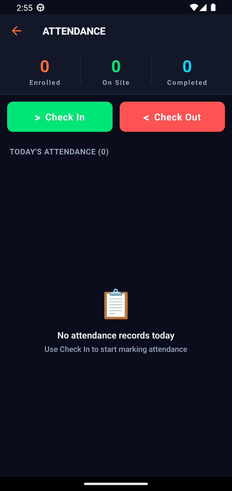
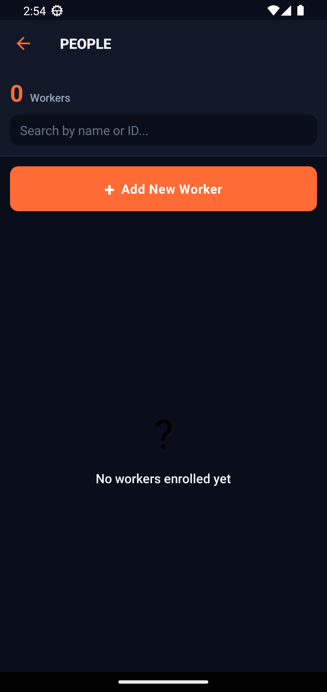
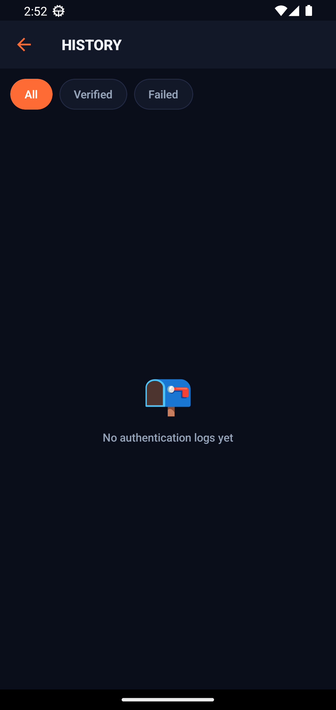
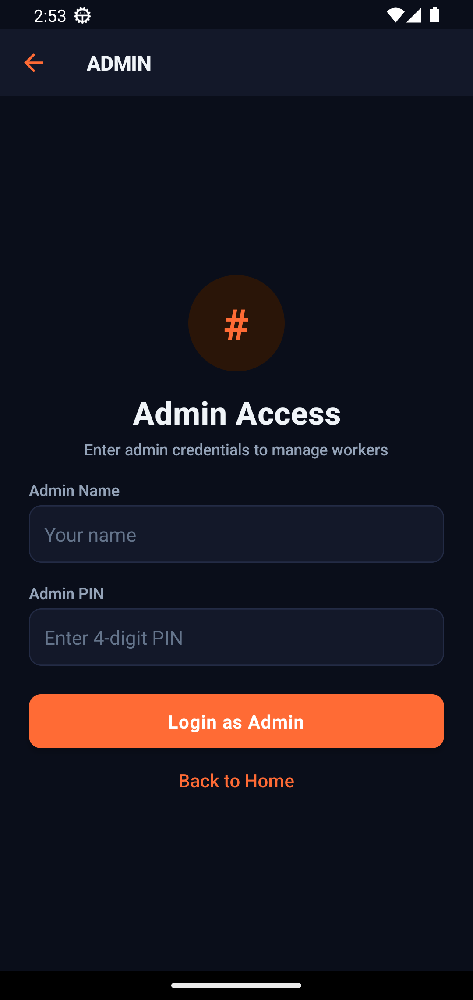
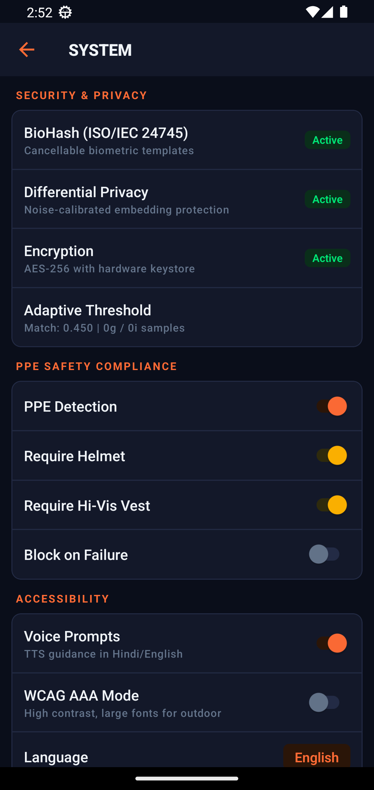

<div align="center">


# NHAI Face Auth

### Offline-first biometric authentication & attendance for highway worksites
**NHAI Hackathon 7.0 · Datalake 3.0 Ready**

[](#-the-custom-model)
[](#-the-custom-model)
[](#-the-custom-model)
[](#-features)

</div>

---

## 🛣️ The Problem

NHAI manages 50,000+ highway construction workers across remote stretches with **little or no connectivity**. Marking attendance reliably — and proving *who* was actually on-site — is hard. Paper registers and proxy punching are rampant, and cloud face-recognition APIs are useless without a signal.

## 💡 Our Solution

A **fully offline** Android app that authenticates workers by face, in seconds, on a regular phone:

- A **custom face-recognition model we trained ourselves** (99.28% LFW)
- **Liveness + anti-spoofing** so a photo or video can't fool it
- **Privacy-preserving BioHash** templates — the raw face is never stored
- **GPS geofencing + PPE checks** turn attendance into a safety checkpoint
- **Background sync** to NHAI Datalake 3.0 the moment a signal returns

> Everything below runs **on the device**. No server. No internet required.

---

## 🧠 The Custom Model

We did **not** use an off-the-shelf API. We trained **MobileFaceNet with an ArcFace margin head** from scratch on **CASIA-WebFace**, and verified it on the standard **LFW 10-fold** protocol.

| Metric | Result | Hackathon Constraint | Status |
|---|---|---|---|
| **LFW accuracy** | **99.28%** | > 95% | ✅ PASS |
| **Model footprint** | **1.15 MB** (INT8) / 4.0 MB (FP32) | < 20 MB | ✅ PASS |
| **CPU latency / face** | **63 ms** (1 thread) | < 1000 ms | ✅ PASS |
| **Open-source / self-trained** | MobileFaceNet + ArcFace, trained by us | required | ✅ PASS |

**Training setup**
- **Dataset:** CASIA-WebFace — 490,623 images across 10,572 identities
- **Backbone:** MobileFaceNet (~1.0 M parameters, 128-D embedding)
- **Loss:** ArcFace, scale `s=64`, margin `m=0.50`
- **Optimizer:** SGD (momentum 0.9, wd 5e-4) with warmup + cosine LR
- **Hardware:** Kaggle Tesla T4, AMP mixed precision, ~6.6 h for best checkpoint
- **Export:** PyTorch → ONNX (FP32) → dynamic INT8 quantization, parity-checked

📓 Full reproducible notebook: [`notebook/mobilefacenet_training.ipynb`](notebook/mobilefacenet_training.ipynb)
📦 Exported weights: [`artifacts/`](artifacts/) — `mobilefacenet_fp32.pt`, `*_fp32.onnx`, `*_int8.onnx`

> **On-device resilience:** the app runs the ONNX embedding pipeline with an **eye-aligned geometric landmark fallback**, so recognition works on *every* phone — even those whose runtime lacks the quantized operator set. Robustness by design.

---

## ✨ Features

| | |
|---|---|
| 🧠 **Custom face recognition** | Self-trained MobileFaceNet, 128-D embeddings, 99.28% LFW |
| 👁️ **Active liveness** | 3 randomized challenges (blink / smile / head-turn) with live progress |
| 🛡️ **Anti-spoofing** | Laplacian-variance texture analysis blocks print & screen replays |
| 🔐 **BioHash privacy** | ISO/IEC 24745 cancellable templates — raw vector never stored |
| 📍 **GPS geofencing** | Check-in / out validated against site boundaries |
| 🦺 **PPE compliance** | Helmet & hi-vis vest detection gates site entry |
| 📡 **Offline-first sync** | Works with zero signal; syncs to Datalake 3.0 with retry/backoff |
| 🆔 **Aadhaar linkage** | Optional capture with Verhoeff checksum + masked display |
| 📊 **Live analytics** | On-device dashboard: pass rate, confidence, spoof blocks, 7-day trend |
| 🔒 **Encryption at rest** | AES-256-GCM, 3-attempt lockout, GDPR-style retention |
| 🗣️ **Localized** | Hindi / English voice prompts, high-contrast outdoor UI |
| 🛠️ **Admin console** | 2FA admin access, system health, configuration |

---

## 📱 Screens

<div align="center">

&nbsp;
&nbsp;


&nbsp;
&nbsp;


&nbsp;
&nbsp;


</div>

---

## 🏗️ Architecture

```
┌─────────────────────────────────────────────────────────────┐
│                     React Native 0.85 (Hermes)               │
│   Home · Enrol · Authenticate · PPE · Dashboard · Admin …    │
└───────────────┬─────────────────────────────┬───────────────┘
                │                             │
     ┌──────────▼──────────┐       ┌──────────▼───────────┐
     │  Native Kotlin       │       │  Services (TS)        │
     │  FaceProcessor       │       │  bioHash · encryption │
     │  • ML Kit detection  │       │  geofencing · sync    │
     │  • MobileFaceNet ONNX│       │  qualityGate · PPE    │
     │  • eye-aligned 128-D │       │  adaptiveThreshold    │
     │  • Laplacian spoof   │       │  datalakeIntegration  │
     └──────────┬───────────┘       └──────────┬───────────┘
                │                             │
     ┌──────────▼─────────────────────────────▼───────────┐
     │   Encrypted local store (offline-first)             │
     │   → background sync → NHAI Datalake 3.0             │
     └─────────────────────────────────────────────────────┘
```

**Pipeline:** Capture → ML Kit detect → quality check → 128-D embedding → BioHash + AES-256 → (auth) liveness + anti-spoof → cosine match → geofence → attendance record → sync.

---

## 🔌 Datalake 3.0 Integration

```typescript
import { FaceAuthModule } from './services/datalakeIntegration';

// Single call: face auth + liveness + geofence + attendance
const result = await FaceAuthModule.markAttendance(imagePath);
// → result.authenticated, result.withinGeofence, result.attendanceAction

// Sync pending records when connectivity returns
await FaceAuthModule.syncToServer();
```

---

## 🚀 Run It

### Install the APK
1. Download the latest APK from the [**Releases**](../../releases/latest) page.
2. Copy to your Android phone and tap to install (allow "unknown sources").
3. Or via ADB: `adb install -r NHAI-FaceAuth.apk`
4. Enrol a worker → Authenticate. Works fully offline.

> The APK (~159 MB — bundles ML models + JS) exceeds GitHub's 100 MB file limit, so it ships as a **Release asset**, not in the repo tree.

### Build from source
```bash
cd FaceAuthApp
npm install
cd android && ./gradlew assembleDebug
# output: android/app/build/outputs/apk/debug/app-debug.apk
```

### Reproduce the model
Open [`notebook/mobilefacenet_training.ipynb`](notebook/mobilefacenet_training.ipynb) on Kaggle with the CASIA-WebFace `.rec` dataset attached and a **GPU T4** accelerator. It trains, evaluates on LFW, and exports `fp32.pt / fp32.onnx / int8.onnx` with a constraints check.

### Tests
```bash
npx jest          # unit tests for bioHash, embeddings, quality gate, Aadhaar…
npx tsc --noEmit  # type-check
```

---

## 📂 Repository Layout

```
FaceAuthApp/
├─ src/                    # React Native app (screens + services)
│  ├─ screens/             # 12 screens (Home, Enrol, Auth, PPE, Dashboard…)
│  ├─ services/            # bioHash, encryption, geofencing, sync, PPE…
│  └─ assets/              # NHAI logo
├─ android/                # Native Android + Kotlin FaceProcessor module
├─ docs/                   # GitHub Pages site + screenshots
├─ notebook/               # Model training notebook (Kaggle)
├─ artifacts/              # Trained model weights (pt / onnx / int8)
├─ __tests__/              # Unit tests
└─ TECHNICAL_DOCUMENT.md   # Full technical write-up
```

---

## 🛠️ Tech Stack

`React Native 0.85` · `Hermes` · `Kotlin` · `Google ML Kit` · `ONNX Runtime` · `MobileFaceNet + ArcFace` · `PyTorch` · `AES-256-GCM` · `VisionCamera v5`

---

<div align="center">

**NHAI Face Auth** — National Highways Authority of India · Hackathon 7.0
*Custom MobileFaceNet (99.28% LFW) · Offline-first · Privacy by design*

🌐 **Live page:** enable GitHub Pages on `/docs` → `https://Eartherai.github.io/FaceAuthApp/`

</div>
