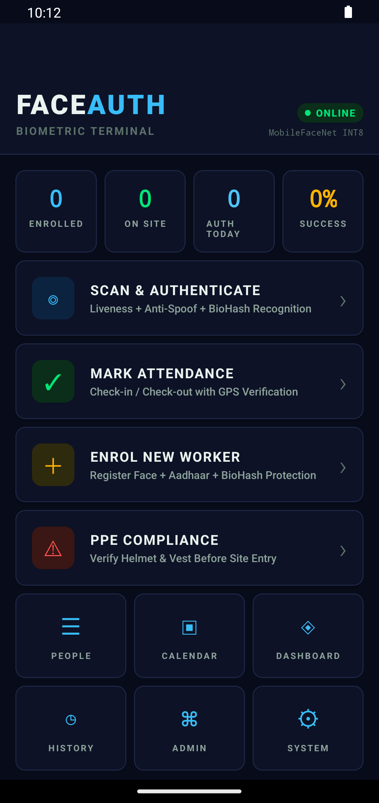
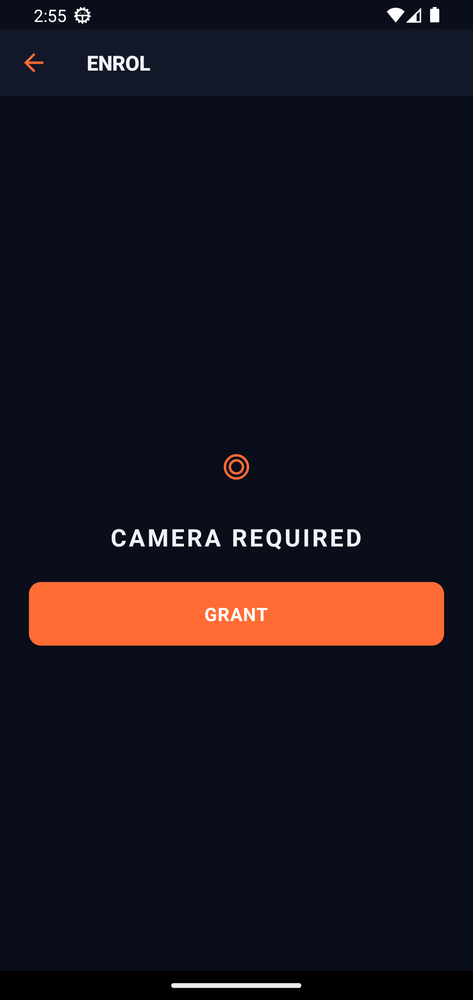
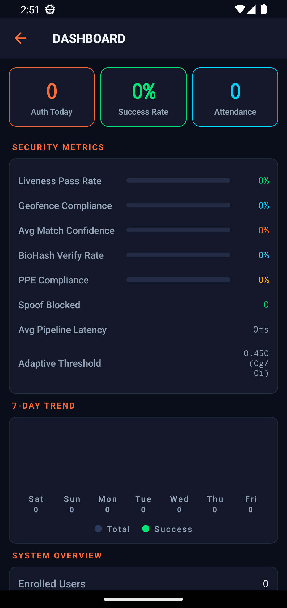
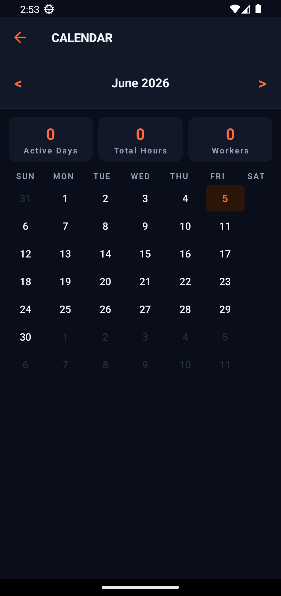

<div align="center">


# NHAI Face Auth

### Offline-first biometric authentication &amp; attendance for highway worksites
**National Highways Authority of India · Hackathon 7.0 · Datalake 3.0 Ready**

[](docs/MODEL.md)
[](docs/MODEL.md)
[](docs/MODEL.md)
[](docs/FEATURES.md)
[](FaceAuthApp)
[](LICENSE)

**[🌐 Live Demo Page](https://Eartherai.github.io/FaceAuthApp/) · [📥 Download APK](../../releases/latest) · [📊 Pitch Deck](presentation/NHAI_FaceAuth_FINAL.pptx) · [🧠 Model](docs/MODEL.md) · [✨ Features](docs/FEATURES.md)**

</div>

---

## 📖 Table of Contents

- [The Problem](#-the-problem)
- [Our Solution](#-our-solution)
- [Screenshots](#-screenshots)
- [The Custom Model](#-the-custom-model-9928-lfw)
- [Features](#-features)
- [Architecture](#-architecture)
- [Quick Start](#-quick-start-5-minutes)
- [Reproduce the Model](#-reproduce-the-model)
- [Project Structure](#-project-structure)
- [Documentation](#-documentation)

---

## 🛣️ The Problem

NHAI manages **50,000+ construction workers** across remote highway stretches with **little or no connectivity**. Marking attendance reliably — and proving *who* was actually on-site — is hard. Paper registers invite proxy punching, and cloud face-recognition APIs are useless without a signal.

## 💡 Our Solution

A **fully offline** Android app that authenticates workers by face in seconds, on an ordinary phone:

| | |
|---|---|
| 🧠 | A **custom face-recognition model we trained ourselves** — 99.28% LFW |
| 👁️ | **Liveness + anti-spoofing** so a photo or video can't fool it |
| 🔐 | **Privacy-preserving BioHash** — the raw face is never stored |
| 📍 | **GPS geofencing + PPE checks** make attendance a safety checkpoint |
| 📡 | **Background sync** to NHAI Datalake 3.0 the moment a signal returns |

> Everything runs **on the device**. No server. No internet required.

---

## 📱 Screenshots

<div align="center">

| Command Center | Face Enrolment | Security Analytics |
|:---:|:---:|:---:|
|  |  |  |
| **Attendance** | **Calendar** | **Worker Registry** |
|  |  |  |
| **Auth History** | **Admin Console** | **System Settings** |
|  |  |  |

</div>

---

## 🧠 The Custom Model (99.28% LFW)

We did **not** use an off-the-shelf API. We trained **MobileFaceNet with an ArcFace margin head** from scratch on **CASIA-WebFace** and verified it on the standard **LFW 10-fold** protocol.

| Metric | Result | Hackathon Constraint | Status |
|---|---|---|:---:|
| **LFW accuracy** | **99.28%** | &gt; 95% | ✅ |
| **Model footprint** | **1.15 MB** (INT8) / 4.0 MB (FP32) | &lt; 20 MB | ✅ |
| **CPU latency / face** | **63 ms** (1 thread) | &lt; 1000 ms | ✅ |
| **Open-source / self-trained** | MobileFaceNet + ArcFace, trained by us | required | ✅ |

- **Dataset:** CASIA-WebFace — 490,623 images / 10,572 identities
- **Backbone:** MobileFaceNet (~1.0 M params, 128-D embedding)
- **Loss:** ArcFace (`s=64`, `m=0.50`) · **Optimizer:** SGD + warmup + cosine LR
- **Export:** PyTorch → ONNX (FP32) → dynamic INT8, parity-checked

📓 **Reproducible notebook:** [`FaceAuthApp/notebook/mobilefacenet_training.ipynb`](FaceAuthApp/notebook/mobilefacenet_training.ipynb)
📦 **Trained weights:** [`FaceAuthApp/artifacts/`](FaceAuthApp/artifacts/) · 📄 **Full write-up:** [`docs/MODEL.md`](docs/MODEL.md)

> **Resilience by design:** on-device the app runs the ONNX embedding with an **eye-aligned geometric landmark fallback**, so recognition works on *every* phone — even those whose runtime lacks the quantized operator set.

---

## ✨ Features

A quick tour — see [`docs/FEATURES.md`](docs/FEATURES.md) for the complete notes on every capability.

| Feature | What it does |
|---|---|
| 🧠 **Custom face recognition** | Self-trained MobileFaceNet, 128-D embeddings, 99.28% LFW |
| 👁️ **Active liveness** | 3 randomized challenges (blink / smile / head-turn), live progress |
| 🛡️ **Anti-spoofing** | Laplacian-variance texture analysis blocks print &amp; screen replays |
| 🔐 **BioHash privacy** | ISO/IEC 24745 cancellable templates — raw vector never stored |
| 📍 **GPS geofencing** | Check-in / out validated against site boundaries |
| 🦺 **PPE compliance** | Helmet &amp; hi-vis vest detection gates site entry |
| 📡 **Offline-first sync** | Works with zero signal; syncs to Datalake 3.0 with retry/backoff |
| 🆔 **Aadhaar linkage** | Optional capture with Verhoeff checksum + masked display |
| 📊 **Live analytics** | On-device dashboard: pass rate, confidence, spoof blocks, 7-day trend |
| 🔒 **Encryption at rest** | AES-256-GCM, 3-attempt lockout, GDPR-style retention |
| 🗣️ **Localized** | Hindi / English voice prompts, high-contrast outdoor UI |
| 🛠️ **Admin console** | 2FA admin access, system health, configuration |

---

## 🏗️ Architecture

```
┌─────────────────────────────────────────────────────────────┐
│                     React Native 0.85 (Hermes)               │
│   Home · Enrol · Authenticate · PPE · Dashboard · Admin …    │
└───────────────┬─────────────────────────────┬───────────────┘
                │                             │
     ┌──────────▼──────────┐       ┌──────────▼───────────┐
     │  Native Kotlin       │       │  Services (TypeScript)│
     │  FaceProcessor       │       │  bioHash · encryption │
     │  • ML Kit detection  │       │  geofencing · sync    │
     │  • MobileFaceNet ONNX│       │  qualityGate · PPE    │
     │  • eye-aligned 128-D │       │  adaptiveThreshold    │
     │  • Laplacian spoof   │       │  datalakeIntegration  │
     └──────────┬───────────┘       └──────────┬───────────┘
                │                             │
     ┌──────────▼─────────────────────────────▼───────────┐
     │   Encrypted local store (offline-first)             │
     │   → background sync → NHAI Datalake 3.0             │
     └─────────────────────────────────────────────────────┘
```

Full details: [`docs/ARCHITECTURE.md`](docs/ARCHITECTURE.md) · Threat model: [`docs/SECURITY.md`](docs/SECURITY.md)

---

## 🚀 Quick Start (5 minutes)

### A) Just run the app
1. Download the latest APK from the [**Releases**](../../releases/latest) page.
2. Copy it to an Android phone and tap to install (allow "unknown sources"), **or** `adb install -r NHAI-FaceAuth.apk`.
3. Open **NHAI Face Auth** → **Enrol New Worker** → then **Scan &amp; Authenticate**. Works fully offline.

### B) Build from source

**Prerequisites**

| Tool | Version |
|---|---|
| Node.js | ≥ 18 (LTS) |
| JDK | 17 |
| Android SDK | Platform 35, Build-Tools 35 |
| NDK | as pinned by RN 0.85 |

```bash
git clone https://github.com/Eartherai/FaceAuthApp.git
cd FaceAuthApp
npm install

# Build a standalone debug APK (bundles JS + ML models — no Metro/server needed)
cd android
./gradlew assembleDebug          # Windows: .\gradlew.bat assembleDebug
# → android/app/build/outputs/apk/debug/app-debug.apk
```

Install the freshly built APK:
```bash
adb install -r android/app/build/outputs/apk/debug/app-debug.apk
```

> Detailed, OS-by-OS build steps and troubleshooting are in [`docs/BUILD.md`](docs/BUILD.md).

### C) Run tests
```bash
cd FaceAuthApp
npx jest          # unit tests: bioHash, embeddings, quality gate, Aadhaar…
npx tsc --noEmit  # type-check
```

---

## 🔬 Reproduce the Model

1. Open [`FaceAuthApp/notebook/mobilefacenet_training.ipynb`](FaceAuthApp/notebook/mobilefacenet_training.ipynb) on **Kaggle**.
2. Attach the **CASIA-WebFace `.rec`** dataset and set **Accelerator → GPU T4**.
3. Run all cells. It trains MobileFaceNet+ArcFace, evaluates on **LFW**, and exports `fp32.pt / fp32.onnx / int8.onnx` with an automatic constraints check (size &lt; 20 MB, latency &lt; 1 s, LFW &gt; 95%).
4. Drop the exported `mobilefacenet_int8.onnx` into `FaceAuthApp/android/app/src/main/assets/`.

Full methodology and results: [`docs/MODEL.md`](docs/MODEL.md).

---

## 📂 Project Structure

```
FaceAuthApp/
├─ README.md                     ← you are here
├─ LICENSE                       (MIT)
├─ docs/                         GitHub Pages site + documentation
│  ├─ index.html                 animated landing page
│  ├─ FEATURES.md                complete feature notes
│  ├─ MODEL.md                   model training + results
│  ├─ ARCHITECTURE.md            system design
│  ├─ SECURITY.md                threat model & mitigations
│  ├─ BUILD.md                   reproducible build guide
│  └─ screenshots/               app screenshots
├─ FaceAuthApp/                  the React Native application
│  ├─ src/                       screens + services (TypeScript)
│  ├─ android/                   native Android + Kotlin FaceProcessor
│  ├─ notebook/                  model training notebook (Kaggle)
│  ├─ artifacts/                 trained model weights (pt / onnx / int8)
│  ├─ __tests__/                 unit tests
│  └─ TECHNICAL_DOCUMENT.md      full technical write-up
└─ presentation/                 pitch deck (.pptx)
```

---

## 📚 Documentation

| Doc | What's inside |
|---|---|
| [**FEATURES.md**](docs/FEATURES.md) | Every feature, how it works, why it matters |
| [**MODEL.md**](docs/MODEL.md) | Training setup, dataset, results, reproduction, integration |
| [**ARCHITECTURE.md**](docs/ARCHITECTURE.md) | Pipeline, modules, data flow, performance budget |
| [**SECURITY.md**](docs/SECURITY.md) | Threat model, mitigations, privacy guarantees |
| [**BUILD.md**](docs/BUILD.md) | Prerequisites, clean build, run, test, troubleshooting |
| [**TECHNICAL_DOCUMENT.md**](FaceAuthApp/TECHNICAL_DOCUMENT.md) | End-to-end technical reference |

---

## 🛠️ Tech Stack

`React Native 0.85` · `Hermes` · `Kotlin` · `Google ML Kit` · `ONNX Runtime` · `MobileFaceNet + ArcFace` · `PyTorch` · `AES-256-GCM` · `VisionCamera v5`

---

<div align="center">

**NHAI Face Auth** — National Highways Authority of India · Hackathon 7.0
*Custom MobileFaceNet (99.28% LFW) · Offline-first · Privacy by design*

⭐ If this project impresses you, give it a star.

</div>
